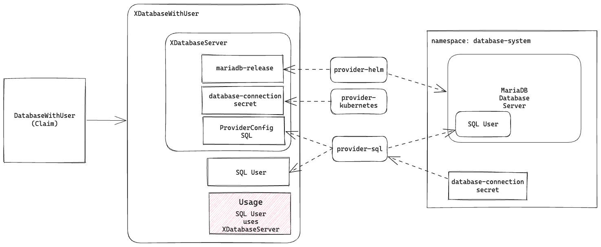

# Deletion Ordering with Usage API

This lab demonstrates how to use the Usage API to control the order in which
deletions are processed for resources that are part of the same composite/claim.

> [!NOTE]  
> Usage API is an alpha feature introduced with Crossplane 1.14. 
> Alpha features aren't enabled by default.
>
> Enable `Usage` support by passing the `--enable-usages` flag to the Crossplane pod.

We will use the following Compositions where a SQL User is created into a MariaDB Server which is
created as part of the same claim/composite:



## Prerequisites

A fresh Kubernetes cluster with nothing installed.
A kind cluster is recommended.

## Steps

1. Run `./setup.sh` which will take care of the following:
   1. Installs UXP with the Usage API enabled, e.g. `--enable-usages`
   2. Applies the manifests under `setup` directory which install the required providers as well as the `CompositeResourceDefinitions`.
   3. Configures the `provider-kubernetes` and `provider-helm` to work within the same Kubernetes cluster.

2. Open `composition.yaml` and extend the spec.resources array with the following resource definition:

   ```yaml
   - name: database-user-uses-server
     base:
       apiVersion: apiextensions.crossplane.io/v1alpha1
       kind: Usage
       spec:
         of:
           apiVersion: example.io/v1alpha1
           kind: XDatabaseServer
           resourceSelector:
             matchControllerRef: true
         by:
           apiVersion: mysql.sql.crossplane.io/v1alpha1
           kind: User
           resourceSelector:
             matchControllerRef: true
   ```

3. Create the updated composition with `kubectl create -f composition.yaml`.
4. Create the claim and wait until it is ready:

```bash
kubectl apply -f claim.yaml
kubectl wait -f claim.yaml --for condition=ready --timeout 5m
```

5. Check the `Usage` resource that is created as part of the claim:

```bash
❯ kubectl get usages.apiextensions.crossplane.io
NAME                       DETAILS                                                                       READY   AGE
example-user-t56ng-rg8q7   User/example-user-t56ng-z7s6j uses XDatabaseServer/example-user-t56ng-jgv4j   True    5s
```

6. Try deleting the resource in use with `kubectl` and observe that it is prevented:

```bash
❯ kubectl delete XDatabaseServer --all # using --all for convenience, but you can also specify the name
Error from server (This resource is in-use by 1 Usage(s), including the Usage "example-user-t56ng-rg8q7" by resource User/example-user-t56ng-z7s6j.): admission webhook "nousages.apiextensions.crossplane.io" denied the request: This resource is in-use by 1 Usage(s), including the Usage "example-user-t56ng-rg8q7" by resource User/example-user-t56ng-z7s6j.
```

7. Delete the claim and verify that no managed resources are left behind (may take a few seconds):

```bash
❯ kubectl delete -f claim.yaml
databasewithuser.example.io "example-user" deleted
❯ kubectl get managed
No resources found
```

Without the Usage resource, the deletion of the SQL User resource could have
failed since either `database-connection-secret` or the `MariaDB Server` itself
may have gone before SQL User is successfully cleaned up. The Usage resource ensures
that any resources that are part of the `XDatabaseServer` are not deleted until the
SQL User resource is deleted.

### Cleanup

The composite and managed resources created by this lab were already deleted in the previous step.
To clean up the providers and the `CompositeResourceDefinitions` that were installed
by the `setup.sh` script as well as the UXP installation, run the following:

```bash
./cleanup.sh
```
